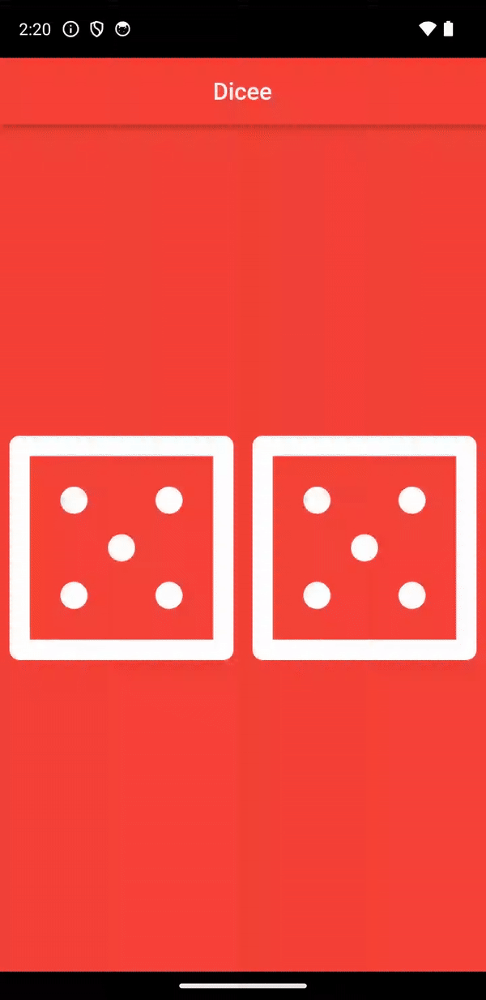

# Flutter Dicee App

![Dicee App Demo]



## Description

The Flutter Dicee App is a simple mobile application that simulates the rolling of two dice. It provides a fun and interactive way to make decisions, settle arguments, or just have some casual fun by virtually rolling a pair of dice.

The app is built using the Flutter framework, making it cross-platform and compatible with both Android and iOS devices. It features a clean and user-friendly interface that mimics the appearance of real dice, and each time you shake your device or tap the "Roll" button, the dice are rolled, and random values are generated for each die face. The result is displayed on the screen, and you can use it for various purposes, such as games or random selections.

## Features

- Dice rolling simulation.
- Random values for each dice face.
- User-friendly and intuitive design.
- Cross-platform compatibility (Android and iOS).

## Getting Started

1. **Prerequisites**: Make sure you have Flutter installed. If not, follow the [official Flutter installation guide](https://flutter.dev/docs/get-started/install).

2. **Clone the Repository**:

   ```bash
   git clone https://github.com/Badrudin-cloud/flutter_dicee_app.git
